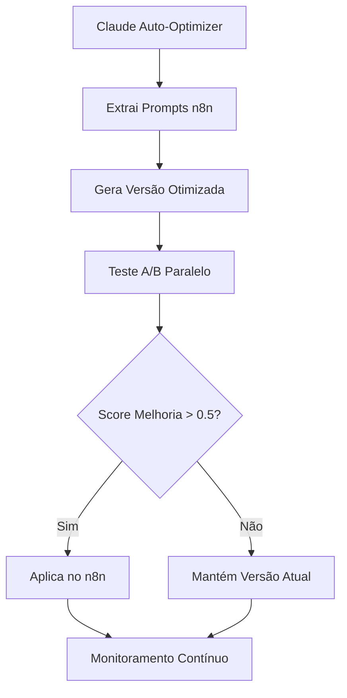

# Configuração de Testes A/B com n8n - Integração Claude Auto-Optimizer

> **🔗 DOCUMENTO TÉCNICO**: Configurações específicas para integração completa entre Claude Auto-Optimizer, n8n e sistema de 4 agentes

---

## 🎯 **VISÃO GERAL DA INTEGRAÇÃO**

### Fluxo Completo Integrado


### Componentes do Sistema
1. **Claude Auto-Optimizer** - Otimização e testes
2. **n8n API** - Workflows e prompts atuais
3. **GitHub** - Configurações e métricas
4. **Sistema 4 Agentes** - Validação e documentação

---

## 🔧 **CONFIGURAÇÕES DE CONEXÃO**

### Variáveis de Ambiente
```bash
# .env - Configuração completa
N8N_API_URL=https://n8n.synapseautointeligente.com.br/api/v1
N8N_API_KEY=[N8N_API_KEY_AQUI]

GITHUB_TOKEN=[GITHUB_TOKEN_AQUI]
GITHUB_OWNER=gabrielteoodoro
GITHUB_REPO=workflow-configs---Bable-PET

WEBHOOK_PRODUCTION=https://n8n.synapseautointeligente.com.br/webhook/3d3c9aa0-361c-4284-9ebc-c6a2b77257f5
WEBHOOK_TEST=https://n8n.synapseautointeligente.com.br/webhook/test-3d3c9aa0-361c-4284-9ebc-c6a2b77257f5

CLAUDE_AUTO_OPTIMIZER_PORT=8080
PERFORMANCE_THRESHOLD=0.5
MIN_SCORE_APPLY=8.0
```

### Configurações de Segurança
```json
{
  "security_settings": {
    "require_approval_for_apply": true,
    "max_concurrent_tests": 3,
    "rollback_on_failure": true,
    "backup_before_apply": true,
    "test_timeout_seconds": 30
  }
}
```

---

## 🎭 **MAPEAMENTO DE WORKFLOWS**

### Workflows Bable Pet Identificados
```json
{
  "workflows": {
    "agente-orquestrador-e-mestre-bable-pet": {
      "n8n_workflow_id": "DUOuKlAbIvwd9c3v",
      "status": "inactive",
      "priority": "CRITICAL",
      "ai_nodes": [
        {
          "name": "Agente Orquestrador Bable Pet",
          "type": "agent",
          "prompt_field": "text"
        }
      ],
      "dependencies": ["all_consultants"],
      "test_scenarios": [
        "ORQUESTRADOR_BAIXA_SAUDACAO_001",
        "ORQUESTRADOR_MEDIA_MULTIPLAS_INTENCOES_002",
        "ORQUESTRADOR_ALTA_AMBIGUIDADE_003"
      ]
    },
    "integracao-chatwoot-evolution-api-bable-pet": {
      "n8n_workflow_id": "4D138Ti5vWDeG91B",
      "status": "active",
      "priority": "HIGH",
      "ai_nodes": [],
      "role": "integration_hub"
    },
    "franquia-consultor": {
      "n8n_workflow_id": "ZrbTnMDgBq18N3xv",
      "status": "inactive",
      "priority": "MEDIUM",
      "ai_nodes": [
        {
          "name": "Agente Franquia",
          "type": "agent",
          "prompt_field": "text"
        }
      ],
      "test_scenarios": [
        "FRANQUIA_BAIXA_INTERESSE_INICIAL_001",
        "FRANQUIA_ALTA_QUALIFICACAO_DETALHADA_002"
      ]
    },
    "agendamento-consultor": {
      "n8n_workflow_id": "KRlswJLa4CmAvWIL",
      "status": "inactive",
      "priority": "HIGH",
      "ai_nodes": [
        {
          "name": "Agente Agendamento",
          "type": "agent",
          "prompt_field": "text"
        }
      ],
      "test_scenarios": [
        "AGENDAMENTO_BAIXA_PRIMEIRO_001",
        "AGENDAMENTO_MEDIA_REAGENDAMENTO_002",
        "AGENDAMENTO_ALTA_CANCELAMENTO_FRUSTRADO_003"
      ]
    },
    "saudacao-consultor": {
      "n8n_workflow_id": "r3TWbsZJHNf2iRXC",
      "status": "inactive", 
      "priority": "HIGH",
      "ai_nodes": [
        {
          "name": "Agente Saudação",
          "type": "agent",
          "prompt_field": "text"
        }
      ],
      "test_scenarios": [
        "SAUDACAO_BAIXA_CLIENTE_NOVO_001",
        "SAUDACAO_MEDIA_CLIENTE_CADASTRADO_002",
        "SAUDACAO_ALTA_MULTIPLAS_DELEGACOES_003"
      ]
    },
    "comercial-consultor": {
      "n8n_workflow_id": "lM9kCZbVaFRnVWid",
      "status": "inactive",
      "priority": "HIGH", 
      "ai_nodes": [
        {
          "name": "Agente Comercial",
          "type": "agent",
          "prompt_field": "text"
        }
      ],
      "test_scenarios": [
        "COMERCIAL_BAIXA_PRECO_SIMPLES_001",
        "COMERCIAL_MEDIA_MULTIPLOS_SERVICOS_002",
        "COMERCIAL_ALTA_RACA_DESCONHECIDA_003"
      ]
    },
    "faq-consultor": {
      "n8n_workflow_id": "Q8TlBCT8t9lYEZgF",
      "status": "inactive",
      "priority": "MEDIUM",
      "ai_nodes": [
        {
          "name": "Agente FAQ",
          "type": "agent", 
          "prompt_field": "text"
        }
      ],
      "test_scenarios": [
        "FAQ_BAIXA_HORARIO_001",
        "FAQ_MEDIA_POLITICAS_002",
        "FAQ_ALTA_EMERGENCIA_003"
      ]
    }
  }
}
```

---

## 🧪 **PROTOCOLO DE TESTES A/B**

### Configuração de Teste por Agente
```json
{
  "test_configuration": {
    "concurrent_tests": true,
    "test_duration_minutes": 5,
    "scenarios_per_agent": 3,
    "metrics_collection": {
      "response_time": true,
      "success_rate": true,
      "human_score": true,
      "token_usage": true,
      "error_count": true
    }
  }
}
```

### Fluxo de Teste Automatizado
```bash
#!/bin/bash
# run_ab_test.sh - Executa teste A/B completo

WORKFLOW_ID=$1
SCENARIO_ID=$2

echo "🚀 Iniciando teste A/B para $WORKFLOW_ID"

# 1. PREPARAÇÃO
echo "📋 Extraindo prompt atual..."
python claude-auto-optimizer/extract_prompt.py $WORKFLOW_ID

echo "🤖 Gerando versão otimizada..."
python claude-auto-optimizer/optimize_prompt.py $WORKFLOW_ID

# 2. EXECUÇÃO PARALELA
echo "🔄 Executando testes paralelos..."
python claude-auto-optimizer/run_test.py $WORKFLOW_ID $SCENARIO_ID --version=current &
CURRENT_PID=$!

python claude-auto-optimizer/run_test.py $WORKFLOW_ID $SCENARIO_ID --version=optimized &
OPTIMIZED_PID=$!

# Aguardar conclusão
wait $CURRENT_PID
wait $OPTIMIZED_PID

# 3. ANÁLISE
echo "📊 Analisando resultados..."
python claude-auto-optimizer/compare_results.py $WORKFLOW_ID $SCENARIO_ID

# 4. DECISÃO
SCORE_DIFF=$(python claude-auto-optimizer/get_score_diff.py $WORKFLOW_ID $SCENARIO_ID)
if (( $(echo "$SCORE_DIFF > 0.5" | bc -l) )); then
    echo "✅ Aplicando otimização (melhoria: $SCORE_DIFF)"
    python claude-auto-optimizer/apply_optimization.py $WORKFLOW_ID --confirm
else
    echo "⏸️ Mantendo versão atual (melhoria insuficiente: $SCORE_DIFF)"
fi

echo "📝 Teste A/B concluído para $WORKFLOW_ID"
```

---

## 📊 **CONFIGURAÇÕES DE MÉTRICAS**

### Thresholds de Performance
```json
{
  "performance_thresholds": {
    "response_time_ms": {
      "excellent": 1000,
      "good": 2000,
      "acceptable": 3000,
      "poor": 5000
    },
    "success_rate": {
      "excellent": 0.95,
      "good": 0.90,
      "acceptable": 0.85,
      "poor": 0.80
    },
    "human_score": {
      "excellent": 9.0,
      "good": 8.0,
      "acceptable": 7.0,
      "poor": 6.0
    },
    "token_efficiency": {
      "excellent": 0.20,
      "good": 0.15,
      "acceptable": 0.10,
      "poor": 0.05
    }
  }
}
```

### Configuração de Coleta de Dados
```json
{
  "metrics_collection": {
    "github_storage": {
      "metrics_file": "performance/metrics.json",
      "history_file": "performance/optimization-history.json",
      "commit_on_update": true
    },
    "retention_days": 30,
    "aggregation_intervals": ["1h", "24h", "7d", "30d"],
    "alerts": {
      "performance_degradation": {
        "threshold": -0.2,
        "notification": "email"
      },
      "error_spike": {
        "threshold": 0.1,
        "notification": "webhook"
      }
    }
  }
}
```

---

## 🔄 **PROTOCOLOS DE APLICAÇÃO**

### Critérios de Aplicação Automática
```python
def should_apply_optimization(current_metrics, optimized_metrics):
    """Determina se otimização deve ser aplicada"""
    
    # Critérios obrigatórios
    score_improvement = optimized_metrics['human_score'] - current_metrics['human_score']
    if score_improvement < 0.5:
        return False, "Melhoria insuficiente no score humano"
    
    # Não pode piorar métricas críticas
    if optimized_metrics['success_rate'] < current_metrics['success_rate']:
        return False, "Taxa de sucesso piorou"
        
    if optimized_metrics['response_time'] > current_metrics['response_time'] * 1.2:
        return False, "Tempo de resposta piorou significativamente"
    
    # Verificações de segurança
    if optimized_metrics['human_score'] < 8.0:
        return False, "Score humano abaixo do mínimo aceitável"
        
    # Aprovado para aplicação
    return True, f"Aprovado - Melhoria: {score_improvement:.1f} pontos"
```

### Processo de Rollback
```json
{
  "rollback_configuration": {
    "automatic_triggers": [
      "success_rate < 0.8",
      "human_score < 7.0", 
      "response_time > 5000ms",
      "error_rate > 0.1"
    ],
    "rollback_timeout_minutes": 30,
    "backup_retention_hours": 72,
    "notification_channels": ["email", "slack"]
  }
}
```

---

## 🎯 **CENÁRIOS DE TESTE ESPECÍFICOS**

### Cenários por Categoria
```yaml
# ORQUESTRADOR - Teste de identificação de intenções
ORQUESTRADOR_BAIXA_SAUDACAO_001:
  input: "oi tudo bem?"
  expected_intentions: ["SAUDACAO"]
  success_criteria:
    - JSON válido retornado
    - Intenção correta identificada
    - Tool think1 usado

ORQUESTRADOR_MEDIA_MULTIPLAS_INTENCOES_002:
  input: "oi quero agendar banho e saber preço"
  expected_intentions: ["SAUDACAO", "AGENDAMENTO", "COMERCIAL"]
  success_criteria:
    - Múltiplas intenções identificadas
    - Priorização correta
    - Análise contextual adequada

ORQUESTRADOR_ALTA_AMBIGUIDADE_003:
  input: "preciso resolver uma coisa do meu pet"
  expected_intentions: ["INDEFINIDO"]
  success_criteria:
    - Reconhece ambiguidade
    - Não força classificação incorreta
    - Sugere esclarecimento

# COMERCIAL - Teste de precificação
COMERCIAL_BAIXA_PRECO_SIMPLES_001:
  input: "quanto custa banho para golden retriever?"
  expected_actions:
    - Identificar raça
    - Consultar grupo (G4)
    - Buscar preço banho G4
    - Oferecer assinatura se não membro
  success_criteria:
    - Preço correto informado
    - Raça mapeada corretamente
    - Tom consultivo e empático

COMERCIAL_ALTA_RACA_DESCONHECIDA_003:
  input: "quanto custa banho para vira-lata grande?"
  expected_actions:
    - Reconhecer limitação na base
    - Usar lógica fallback
    - Solicitar mais informações
    - Manter tom profissional
  success_criteria:
    - Não falha por raça desconhecida
    - Propõe alternativa viável
    - Mantém qualidade do atendimento
```

### Scripts de Teste Automatizado
```bash
# test_all_scenarios.sh
#!/bin/bash

SCENARIOS=(
  "ORQUESTRADOR_BAIXA_SAUDACAO_001"
  "ORQUESTRADOR_MEDIA_MULTIPLAS_INTENCOES_002" 
  "COMERCIAL_BAIXA_PRECO_SIMPLES_001"
  "COMERCIAL_ALTA_RACA_DESCONHECIDA_003"
  "AGENDAMENTO_BAIXA_PRIMEIRO_001"
  "SAUDACAO_MEDIA_CLIENTE_CADASTRADO_002"
)

for SCENARIO in "${SCENARIOS[@]}"; do
  echo "🧪 Testando cenário: $SCENARIO"
  python claude-auto-optimizer/test_scenario.py $SCENARIO
  
  if [ $? -eq 0 ]; then
    echo "✅ $SCENARIO - PASSOU"
  else
    echo "❌ $SCENARIO - FALHOU"
  fi
done

echo "📊 Gerando relatório consolidado..."
python claude-auto-optimizer/generate_test_report.py
```

---

## 🔗 **INTEGRAÇÃO COM SISTEMA DE 4 AGENTES**

### Workflow Integrado
```
1. Agent 1 (Architect) 
   └── Identifica problemas via análise de logs
   └── Propõe otimizações específicas
   └── Define cenários de teste

2. Claude Auto-Optimizer
   └── Implementa otimizações sugeridas
   └── Executa testes A/B automaticamente
   └── Gera métricas comparativas

3. Agent 3 (Validator)
   └── Valida resultados dos testes A/B
   └── Aprova/rejeita aplicação
   └── Documenta problemas encontrados

4. Agent 2 (Builder) 
   └── Aplica otimizações aprovadas no n8n
   └── Monitora aplicação em produção
   └── Executa rollback se necessário

5. Agent 4 (Writer)
   └── Documenta melhorias aplicadas  
   └── Atualiza configurações
   └── Mantém histórico de otimizações
```

### Pontos de Integração
```json
{
  "integration_points": {
    "architect_to_optimizer": {
      "input_format": "problem_specification.json",
      "trigger": "performance_degradation_detected"
    },
    "optimizer_to_validator": {
      "input_format": "ab_test_results.json", 
      "trigger": "test_completed"
    },
    "validator_to_builder": {
      "input_format": "validation_approval.json",
      "trigger": "optimization_approved"
    },
    "builder_to_writer": {
      "input_format": "deployment_results.json",
      "trigger": "optimization_applied"
    }
  }
}
```

---

## ⚠️ **PROTOCOLOS DE SEGURANÇA**

### Safeguards Obrigatórios
1. **Backup Automático**: Sempre salvar versão anterior antes de aplicar
2. **Teste em Ambiente Isolado**: Nunca testar diretamente em produção
3. **Aprovação Manual**: Para otimizações críticas (score < 9.0)
4. **Monitoramento Contínuo**: 48h de monitoramento pós-aplicação
5. **Rollback Rápido**: Capacidade de reverter em <5 minutos

### Configurações de Segurança
```json
{
  "safety_configuration": {
    "require_manual_approval": {
      "critical_workflows": ["agente-orquestrador-e-mestre-bable-pet"],
      "low_confidence_scores": "< 8.5",
      "major_changes": "token_usage_change > 30%"
    },
    "automatic_rollback": {
      "error_rate_threshold": 0.15,
      "success_rate_drop": 0.2,
      "response_time_increase": 2.0,
      "monitoring_duration_hours": 48
    }
  }
}
```

---

## 📝 **COMANDOS DE OPERAÇÃO**

### Comandos Principais
```bash
# Descobrir workflows automaticamente
python claude-auto-optimizer/n8n_discovery_script.py --interactive

# Criar estrutura GitHub
python claude-auto-optimizer/github_structure_creator.py

# Otimizar workflow específico
python claude-auto-optimizer/claude_auto_optimizer.py optimize agente-orquestrador-e-mestre-bable-pet

# Executar teste A/B completo
./run_ab_test.sh agente-orquestrador-e-mestre-bable-pet ORQUESTRADOR_BAIXA_SAUDACAO_001

# Monitorar todos workflows
python claude-auto-optimizer/claude_auto_optimizer.py monitor

# Gerar relatório de performance
python claude-auto-optimizer/generate_performance_report.py --last-7-days

# Rollback de otimização
python claude-auto-optimizer/rollback_optimization.py agente-orquestrador-e-mestre-bable-pet --to-version=20250810_143022
```

### Comandos de Debug
```bash
# Verificar conectividade
curl -H "X-N8N-API-KEY: $N8N_API_KEY" "$N8N_API_URL/workflows"

# Testar cenário específico
python claude-auto-optimizer/test_single_scenario.py COMERCIAL_ALTA_RACA_DESCONHECIDA_003 --verbose

# Extrair logs de execução
python claude-auto-optimizer/extract_execution_logs.py [execution-id]

# Validar configurações
python claude-auto-optimizer/validate_config.py --check-all
```

---

*Este documento configura a integração completa entre Claude Auto-Optimizer e o sistema Bable Pet, permitindo testes A/B automatizados, aplicação controlada de otimizações e monitoramento contínuo de performance.*